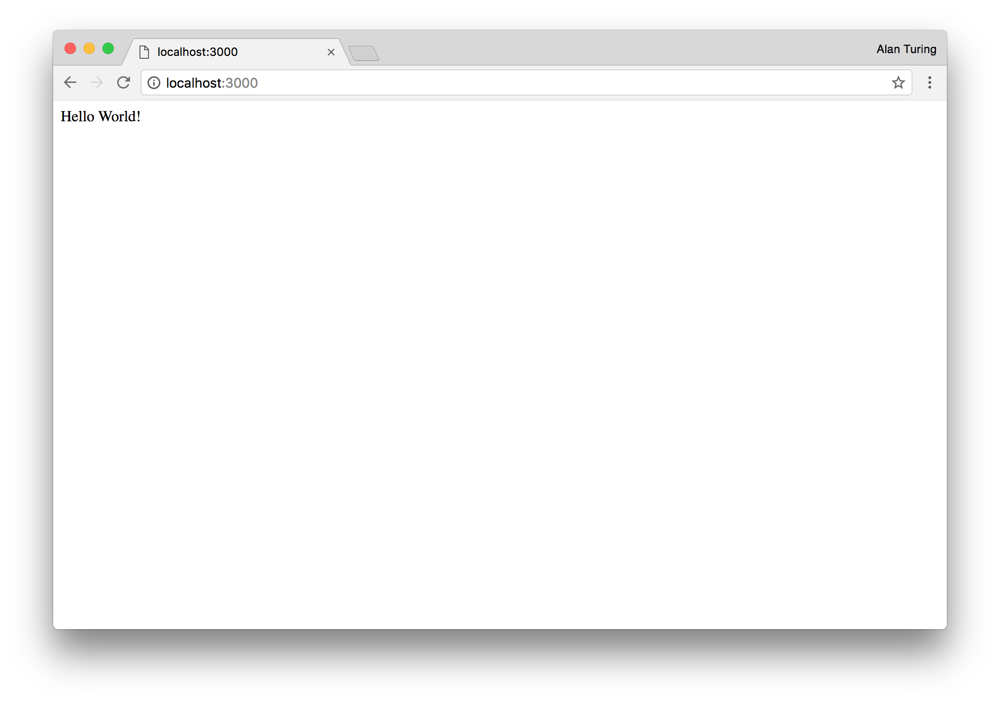

# Heroku Sample App

Learn to write & deploy a straightforward Heroku app built in the Node.js programming language.

## What we're going to make

We're going to make a simple Heroku app that simply says "Hello!" to us. We're going to learn about;

* Writing a simple Node.js app and running it on our own machine
* Creating a Heroku app
* Deploying our code to Heroku

---

## Before we begin...

Before we set off, there's a few prequisites. We're going to need;

* A text editor to write our app
* Node.js installed
* The Heroku app to create and deploy our app
* A Mac computer running latest macOS

### Text editor

Let's go ahead and download Atom, a popular 
and free text editor made by Github.

[Download Atom for macOS](https://atom.io/download/mac)

### Node.js

If you've got Node.js installed already then you can skip this section.

Let's start by opening the Terminal. Hit <kbd>CMD</kbd>+<kbd>Space</kbd>, then search for and open Terminal.

You'll be presented with the following gloriously minimalist screen.


Now paste the following into your terminal. This code will setup a system called [Homebrew](https://brew.sh/), which will make it easy to install Node.js.

```bash
/usr/bin/ruby -e "$(curl -fsSL https://raw.githubusercontent.com/Homebrew/install/master/install)"
```

Once that completes, paste the following lines in seperately, waiting for the prior command to finish

```bash
brew update
brew install node
```

Great! We've now got the latest and greatest version of Node.js setup on your machine.

### Installing Heroku locally

Installing Heroku is easy. Paste the following into your Terminal;

```bash
brew install heroku/brew/heroku
```

---

## Writing our app

Start by making a folder for your app to live in.

Right click on your Desktop & select 'New Folder'. Let's call it `myapp`.

Now open Atom, the text editor we installed earlier and drag the empty `myapp` folder onto the Atom icon in the dock.

Right click on the folder in Atom & select 'New file'. We're going to make a file called `server.js`. Filenames that end  with `.js` are JavaScript files; the programming language we're using for this app.

Let's make this app do something!

Copy the following into your `server.js` file;

```javascript
const express = require('express')
const app = express()
const port = process.env.PORT || 3000

app.get('/', (req, res) => res.send('Hello World!'))

app.listen(port, () => console.log(`Example app listening on port ${port}!`))
```

That's our entire app done! All we have to do now is run it so we can see it in a web browser. Before we worry about how to run it though, let's go over what each line is doing here.

#### Line 1

```javascript
const express = require('express')
```

We're importing functionality from a web framework called [Express](https://expressjs.com/). Express takes a lot of the headaches out of building simple APIs and web apps.

#### Line 2

```javascript
const app = express()
```

Now we're instantiating an Express object within our app. The variable `app` is what we'll use to define the functionality of our app.

#### Line 3

```javascript
const port = process.env.PORT || 3000
```

Let's define a variable for the port our app will listen to. This line says listen to the port number defined in environment variable PORT, or, if no environment variable named PORT is available, listen to port 3000. You'll see why the environment variable is necessary later.

In case you didn't know, most web apps listen to port 80 or 443. When you type [https://www.heroku.com/](https://www.heroku.com/) in your browser, it automatically requests the Heroku homepage on port 443.

#### Line 5

```javascript
app.get('/', (req, res) => res.send('Hello World!'))
```

This one says, when someone requests the `/` path, return `'Hello World!'` to them.

If we wanted the words "Hello world!" to appear on our 'about' page, we'd change this to

```javascript
app.get('/about', (req, res) => res.send('Hello World!'))
```

#### Line 7

```javascript
app.listen(port, () => console.log(`Example app listening on port ${port}!`))
```

Finally, this line tells node.js to launch our web server listening on the port defined in variable `port` and outputs a message telling us this.

---

## Running our app locally

Now that our app is built. We need to run it. We already 
know that our app depends on Express, so let's specify that it in the standard place where node.js dependencies are specified, `package.json`.

### Installing dependencies

We'll use [npm](https://www.npmjs.com/) to specify and install dependencies.

Let's hop into our Terminal and now **drag the `myapp` folder into the Terminal app** and hit <kbd>Enter</kbd>. Then type;

```bash
npm init
```

You can accept the defaults by hitting <kbd>Enter</kbd> at all `npm --init`'s prompts.

This will create a `package.json` file. Now let's specify and download Express. In Terminal type;

```bash
npm install --save express
```

This downloads Express (to the `node_modules` folder) and saves the version number we've downloaded in `package.json`. It's important that Express is listed in our `package.json` so that other developers (and Heroku) know to download it to run this app.


Express has now been installed so our app can use it.

> Extra credit: We could have actually created an even simpler web server -- one with **no** 3rd party dependencies.
> But because most node.js apps use 3rd party dependencies, we've gone down that road.
> Check out [this GitHub gist](https://gist.github.com/crcastle/d99a2213d249ccf6d5c5b53912db83eb) if you want to see what the 3rd party dependency-free version would look like.

### Running our web server

We're finally ready to see our app. In your Terminal type;

```bash
npm start
```

You should see the following appear;

```bash
> heroku-sample-app-nodejs@1.0.0 start /Users/chris.castle/src/heroku-sample-app-nodejs
> node server.js

Example app listening on port 3000!
```

Now open Chrome (or your favourite web browser) and navigate to `http://localhost:3000`.

Congratulations! Your app is running on your machine.



---

## Deploying to Heroku

Having your app running on your own machine is great, but no one else can see it. Let's deploy it to Heroku so everyone can revel in it.

In your Terminal type;

```bash
git add . # Adds all the files in your myapp folder
git commit -m "First"
```

To create our Heroku app we simply...

```bash
heroku create
```


Finally:

```bash
git push heroku master
heroku open
```


There's your app running on Heroku!
